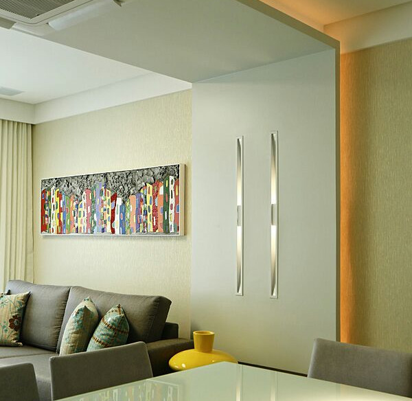
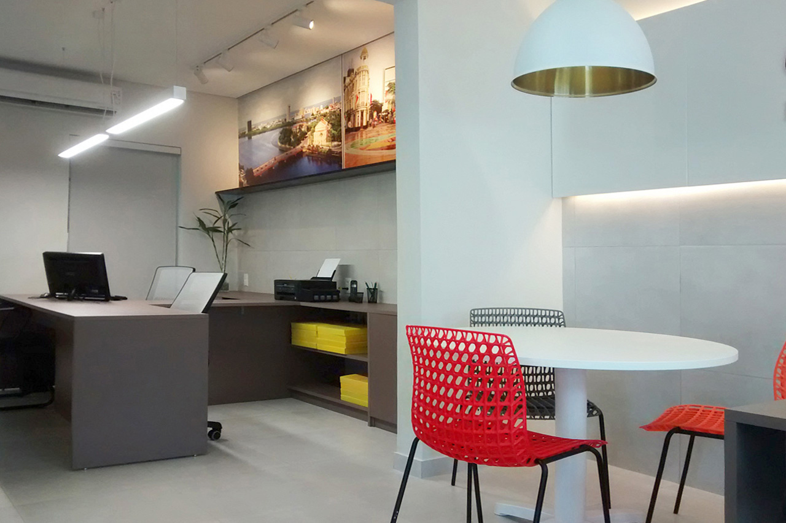

<!-- Main -->

<!-- Two -->
<section id="two" class="spotlights">
	<section>
		
		

			

				<header class="major">
					<h3>Design de Interiores</h3>
				</header>
				
Conciliar conforto, praticidade e beleza. Harmonizar móveis, objetos e acessórios. Planejar cores, acabamentos e iluminação. Nosso escritório visa proporcionar tudo isto aliado às aspirações, necessidades, disponibilidade financeira e principalmente aos <em>sonhos</em> do cliente. Neste intuito, buscamos concretizar o seu sonho, projetando-o ao seu estilo.

				<ul class="actions">
					<li><a href="#contact" class="button">Peça um orçamento</a></li>
				</ul>
			

		

	</section>
	<section>
		
		

			

				<header class="major">
					<h3>Projetos Corporativos</h3>
				</header>
				
Ergonomia, iluminação, e conforto. Um projeto corporativo deve facilitar a circulação de pessoas, otimizar o fluxo das informações e a realização das atividades. Acima de tudo, deve ser projetado de modo a refletir a identidade da empresa. Nosso escritório conta com mais de 50 projetos corporativos já desenvolvidos. Desse modo, proporcionamos uma escolha segura para a concretização do ambiente da sua empresa.

				<ul class="actions">
					<li><a href="#contact" class="button">Peça um orçamento</a></li>
				</ul>
			

		

	</section>
	<section>
		
		

			

				<header class="major">
					<h3>Consultoria</h3>
				</header>
				
Pensado para o cliente que precisa de dicas e informações técnicas para reformar sua casa ou adquirir um imóvel novo, mas não pretende investir em um projeto completo de arquitetura. Nesta consultoria, através de uma visita ao espaço, ou uma conversa por video, nós entendemos quais as principais necessidades e desejos do cliente, analisamos e sugerimos mudanças no layout, orientamos tecnicamente o que precisa ser renovado, adquirido ou substituído, direcionamos a iluminação, além de passar contatos de fornecedores e serviços.

				<ul class="actions">
					<li><a href="#contact" class="button">Peça um orçamento</a></li>
				</ul>
			

		

	</section>
</section>

<!-- Three -->
<section id="three">
	

		<header>
			<h2 style="color: #f1f1f1">Ainda está em dúvida?</h2>
		</header>
		
Não se preocupe!  Se possuir alguma dúvida sobre os serviços listados, entre em contato conosco e iremos sugerir a melhor opção para atender às suas necessidades.

		<ul class="actions">
			<li><a href="#contact" class="button special" style="color: white">Entre em contato</a></li>
		</ul>
	

</section>

